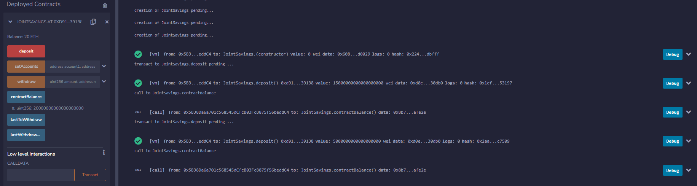

# challenge_20_080323
---
# Smart Contracts
### Using Solidity to create a smart contract to manage a join savings Ethereum account. 
---
## Objective 

Smart contracts allow for the user to create a block-chain across two institutions to manage a joint savings account. In this project, I created a block-chain and added a smart contract that allowed two users to make deposits and withdrawals from a joint owned Ethereum crypto currency account.

---

## Technologies 

The following technologies were leveraged for this assignment. Remix is an online editor for **Solidity**. This allows any user to create a smart contract within a blockchain. Link to Remix is listed below
**Ganache** is used to supply test wallets with sample balances in order to evaluate the functionality of the blockchain and smart contract.

1.[Remix](https://remix.ethereum.org/#lang=en&optimize=false&runs=200&evmVersion=null&version=soljson-v0.8.18+commit.87f61d96.js)

2.[Ganache](https://trufflesuite.com/ganache/)

---

## Results

The following images are screenshots taken after testing the functionality of the smart contract. In the repo, these images are saved in the **Execution Results** folder

Image 1 shows the balance of the initial deposit  15 ether in the joint savings account

Image 2 shows a second deposit of 5 ether into the account

Image 3 shows a withdrawal of 3 ether from the account

Image 4 shows a final withdrawal of 4 ether from the account

 
